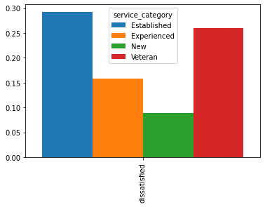
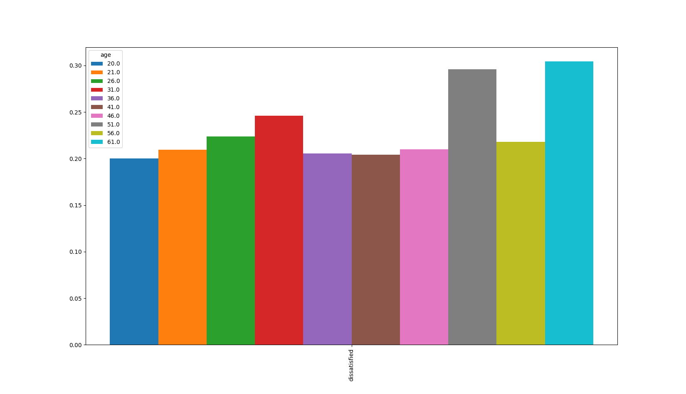
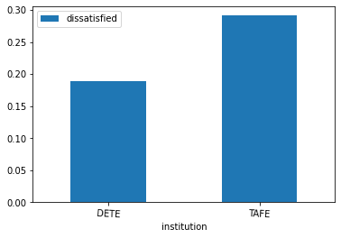

# Reason_for_Resignation_Analysis

This project aims at cleaning and analyzing Employee Exit Survey responses from employees of Department of Education, Training and Employment (DETE), and the Technical and Further Education (TAFE) body of the Queensland government in Australia.

Specifically, I looked to gain answers to the following questions:

   * Are employees who only worked for the institutes for a short period of time resigning due to some kind of dissatisfaction? What about employees who have been there longer?
   
   * Are younger employees resigning due to some kind of dissatisfaction? What about older employees?

i had to combine the two datasets containing results for both surveys to answer the above questions. However, although both used the same survey template, one of them customized some of the answers - something that introduced some complications into my work.

# Data Cleaning

 *    Unnecessary columns for our goals were dropped.
 *   Column names were standardized as much as possible across both columns, to facilitate table merging. In particular:
       *  Capitalization was made lowercase
        * Spaces were replaced with underscores
        * Trailing whitespace from the ends of the strings were removed
  *   Reduced dataframes to include only employees who resigned, and not those who left because they found jobs elsewhere, or retired because of age.
 *    Created a new column that calculates an employee's duration of employment, by calculating the difference between their resignation date and hire           date, using the datetime library.
  *   Identified columns that corresponded to employee dissatisfaction, and more explicitly outlined employee dissatisfaction by creating a new column           that indicated dissatisfaction using Boolean values of True or False, or NaN in the case of
       *  Columns with very large numbers of missing values (> 500) were dropped.
  *  After Merging, it was noticed that institute_service column contained data in inconsistent formats, such as "11-20", and "More than 20 years".            Regular expressions were used to standardize this column into digits, and then the digits were categorized into 4 categories of work experience:
       *  New: Less than 3 years at a company
       *  Experienced: 3-6 years at a company
       *  Established: 7-10 years at a company
       *  Veteran: 11 or more years at a company
   *  Another column was created to reflect this category.
   *  Missing values in the dissatisfied column were filled with False, since that was the most frequent value in that column.

# Visualiztion

# Employee Dissatisfaction by Career Stage:

The graph above suggests that the longer an employee works, the more likely they are to resign citing dissatisfaction with something.

- Employees with less than 3 years of work experience cite dissatisfaction only 30% of the time when resigning, while those who worked 4-7 years cited dissatisfaction 35% of the time.
- In contrast, those with 7 years or more of work experience reported being dissatisfied about 50% of the time when they resigned.
- 
# Employee Dissatisfaction by Age

   Age column was also cleaned and standardized into the same format using Regular expressions, and then categories were made to represent age, which were then used for the visualization.
    
    

In general, older employees seem to be more likely to resign reporting dissatisfaction. This trend is fairly consistent across all age groups, apart from the 26-30 and 31-35 age groups. This might be because older employees could have more accumulated grievances.

A way to address this might be to ensure that older employees were kept satisfied with their working conditions. One reason an older employee might feel disgruntled is because the nature of their job might have changed significantly from what they were used to, and they find it harder to adapt. It might be worth looking into ways to ease this process.

# Employee Dissatisfaction by Institute

Visibly there appears to be a remarkable difference in the reported dissatisfaction rates of employees from the DETE and the TAFE firms.

However,there is a very easy explanation for this discrepancy.
Recall that there were several more columns from the dete survey forms that corresponded to employee dissatisfaction than in TAFE

 Unequalness in how the survey responses were handled by the two institutes was one limitation of encountered in this project

